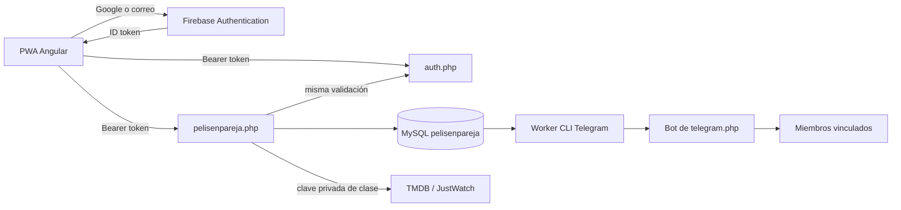

# Arquitectura

## Flujo

El cliente pide un token actualizado a Firebase antes de cada petición. No mantiene un segundo token de sesión de la API. El backend obtiene UID y correo de claims verificados; ignora cualquier identidad del cuerpo enviada como autor del voto.

## Consenso

Cada voto se identifica por `(group_id, uid, media_type, tmdb_id)`. Los títulos vistos tienen clave `(group_id, media_type, tmdb_id)`.

Todos los cambios de votos y membresía bloquean la fila del grupo con `SELECT ... FOR UPDATE` y se guardan en transacción. Se cuentan solo votos `like` de miembros actuales, se exige un mínimo de dos personas y se excluyen todos los títulos de `pp_seen`. Un match requiere tantos síes como miembros actuales.

Hay un solo registro de match por grupo y título. Al invalidarse se desactiva. Si vuelve a lograrse consenso se incrementa su generación. La clave única de aviso `(match_id, generation, uid)` evita duplicados por reintentos de HTTP. Avisos internos y match se guardan en la misma transacción.

`pp_offers` acredita que el servidor ofreció el título a ese usuario con la versión actual de los filtros. Un cliente no puede votar cualquier ID arbitrario saltándose filtros. El endpoint devuelve 409 cuando el mazo está obsoleto o alguien ya marcó el título como visto. Se puede marcar visto directamente desde un match activo. El historial de un voto propio permite reconsiderarlo, incluso tras cambiar preferencias; no permite volver a votar sí/no sobre un título visto.

## Catálogo

- Listado dinámico de plataformas para películas y series en la región del grupo.
- Discover combina plataformas con OR y usa `with_watch_monetization_types=flatrate`.
- Se consulta la ficha detallada con disponibilidad, géneros y países de producción antes de ofrecer un título.
- Categorías y países vetados se comprueban en el servidor. Los países no se deducen del idioma original.
- Se eliminan votos propios y vistos del grupo antes de presentar tarjetas.
- `PelisCatalog.php` añade prioridad a títulos que gustan a miembros actuales y aún no ha votado el usuario. No depende de que TMDB los incluya en la página general. Revalida países, géneros y suscripción antes de registrarlos en `pp_offers`; mezcla dos prioritarios por cada propuesta general.
- `state.priority_keys` permite incorporar síes nuevos durante el sondeo. El cliente conserva la tarjeta activa y promueve las siguientes sin duplicarlas; su registro de votos de la sesión evita reinsertar respuestas que llegaron después de votar.
- Las pestañas Series/Películas/Todo usan un parámetro personal de descubrimiento. La preferencia compartida actúa como valor inicial.
- Favoritos permite alternar los síes propios y los títulos que gustan a cualquier miembro, con paginación, sin duplicados y con decisiones de miembros actuales, incluidos negativos y pendientes. Consultar la lista del grupo no registra nuevas ofertas; las fichas sin voto previo son de lectura. Vistos conserva historial, pero excluye de propuestas y plataformas.
- Plataformas selecciona una suscripción elegida y ordena por estreno original o popularidad TMDB. No se presentan como estadísticas de reproducciones ni fechas de alta en una plataforma. Admite votar desde el catálogo mediante ofertas verificadas.
- Paginación hasta el límite de TMDB, con películas/series intercaladas cuando se eligen ambas.
- Caché en MySQL de 6 horas; países de configuración durante 7 días. La ficha persistida incluye disponibilidad de todas las regiones; cada grupo recibe la de su país.
- `state` refresca la versión del grupo, miembros y títulos retirados cada 15 segundos con la app visible. Favoritos actualiza también los votos visibles durante ese sondeo.

La disponibilidad viene de TMDB/JustWatch y puede cambiar entre actualizaciones. El enlace «Dónde verla» abre la ficha oficial de proveedores de TMDB; no fabrica enlaces profundos a plataformas.

## Telegram

Se reutilizan `MenuDiarioTelegram` y el webhook existentes. El prefijo `pp_` dirige los tokens de vinculación al nuevo helper. Tokens aleatorios, hashes en MySQL, validez 10 minutos, un uso y chats privados.

El worker CLI lee la cola, reclama un envío con un UPDATE condicional y valida miembro, generación de consenso, conexión y preferencias. Reintenta fallos con espera creciente hasta 8 intentos y recupera reclamaciones de procesos muertos tras 5 minutos. Desactiva avisos de matches que dejaron de ser válidos.

La base evita duplicados normales. Como Telegram no admite clave idempotente, un corte después de aceptar un mensaje y antes de guardar `sent` puede causar un reenvío. No se promete exactamente una entrega frente a fallos externos.

## PWA y privacidad

El service worker guarda el shell de la aplicación y carteles públicos. No almacena endpoints auth, grupos, votos, invitaciones ni avisos. Los votos requieren red y solo avanzan la tarjeta después de confirmación del servidor. Los errores transitorios de sondeo no borran el estado visible. El usuario controla la actualización de versiones.

La sesión la gestiona Firebase. Solo el identificador del grupo seleccionado se guarda directamente en localStorage. La clave TMDB y las credenciales del bot permanecen en PHP.

## Referencias técnicas

- [TMDB Discover películas](https://developer.themoviedb.org/reference/discover-movie)
- [TMDB Discover series](https://developer.themoviedb.org/reference/discover-tv)
- [TMDB proveedores](https://developer.themoviedb.org/reference/watch-providers-movie-list)
- [Angular service worker](https://angular.dev/ecosystem/service-workers/getting-started)
